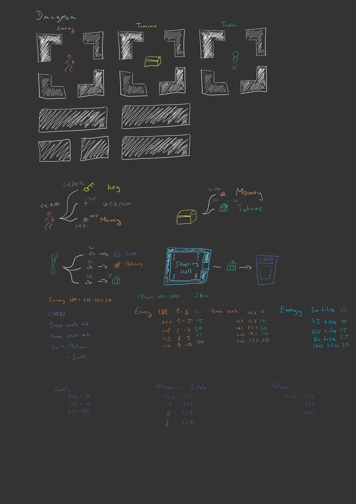

# Lucidity Dungeon
## Timesheet in hours
- Preparation: ||||
- Design: |
- Coding engine: |||||||||||||
- Coding in unity: ||||||||||||||||

## Main points to implement
- Scenes
	- [ ] Main menu scene
	- [ ] Map scene
	- [ ] Camp scene
- Components
    - [ ] Fight minigame
    - [ ] Lockpick minigame
- Level design
    - [ ] Dungeon procedural generator
    - [ ] Rooms - Treasure, Enemy and Merchant
- Gameplay mechanics
    - [ ] Limited energy per run
    - [ ] Flow: Defeat enemy -> get key -> unlock treasure -> get tokens -> get back to exit until energy is depleated 
    - [ ] Buyable upgrades (energy, enemies ...)
    - [ ] Attack with different weapon levels plus spell damage and potion healing during battle
- Builds
    - [ ] Build for Android
    - [ ] Build for WebGL
- Game
    - [ ] Save / Load game
    - [ ] Balanced config via Generic Algorithm

## Story
The game is set within the dreams of a person, and the player must repeatedly journey into a mysterious dungeon, collecting artifacts and coins to improve their chances in subsequent dream runs. Each dream presents a unique level layout, but some common elements persist. The player has limited health and each character comes with distinct stats. The player's inventory contains slots for up to two weapons, multiple scrolls, and potions which help player in battle, which reward him with coins, key or weapon. Keys are used to open chests to get tokens, which can be used outside of dream to buy upgrades into dungoens next runs.

## Game Overview
### Game Concept
Lucidity Dungeon is a top-down 2D action-adventure game featuring grid-based movement and pixel art graphics. The game focuses on exploring dynamically generated dungeons while collecting items, battling NPCs, and progressing through a skill tree.

### Genre
- Action-Adventure
- RPG
- Dungeon Crawler

### Target Audience
Lucidity Dungeon is designed for players who enjoy strategic action, RPG elements, and pixel art aesthetics. The target audience includes both casual and hardcore gamers.

## Gameplay
### Game Structure
The game is divided into two main locations:
- **Base**: Where players can purchase equipment and establish a reset point.
- **Dungeon**: The core gameplay area where players collect coins, artifacts, and venture through multiple levels (locked until unlocked).

### Gameplay Mechanics
- Top-down 2D grid-based movement.
- Dynamic generation of dungeon layouts.
- Combat against hostile NPCs.
- Weapons, potions, and scrolls.

### Player Character
Players can choose from different character classes, including:
- **Warrior**: Equipped with two weapons.
- **Mage**: Scrolls have a chance not to depleate.
- **Advanturer**: 30 more energy.
- **Bard** Lower prices

## Art and Visuals
- Pixel art style.
- Assets from the [RPG Pixel Art Pack](https://assetstore.unity.com/packages/2d/gui/icons/rpg-pixel-art-pack-254546) and [Pixel Art Roguelike Pack](https://assetstore.unity.com/packages/2d/environments/pixel-art-roguelike-pack-217434).

## User Interface
- Main Menu
- Map
- Pause menu

## Game Levels
- Dynamic generation of dungeon layouts.
- Multiple levels, each with increasing difficulty and unique challenges.

## NPCs
- Friendly NPCs, such as traders.
- Hostile NPCs based on their level.

##  Inventory
- Slots for weapons, potions, and scrolls.
- Items have multiple levels of rarity.qq

##  Player Progression
- Skill tree allowing players to customize character abilities.
- Weapon types, spells, and other character-specific improvements.

##  Assets and Resources
### Art Assets
- Pixel art graphics from selected asset packs.
- Backgrounds, character sprites, and environmental elements.

## Sound and Music
Sound effects and music that match the game's retro pixel art style and enhance the player's immersion.
Custom sound effects and music tracks for ambiance and immersion.

##  Technical Requirements
- Platform: WebGL, and Android.
- Development in Unity

## Sketchbook

## Inspiration:
- Decked out (Minecraft)
- Baldurs gate 3 (PC)
- Mini dungeong RPG (Android)

##  Appendices
### References
- [GitHub Repository with Game Assets](https://github.com/EbrithilNogare/LucidityDungeon/assets/22661032/050a272b-d1cb-4be2-8396-9d63ac8a1b41)
- Pixel font from minecraft: https://www.dafont.com/minecraft.font
---

This Game Design Document provides an overview of "Lucidity Dungeon" and serves as a reference for the game's development and design. It outlines the story, gameplay mechanics, art style, and technical requirements necessary for the game's successful creation.
